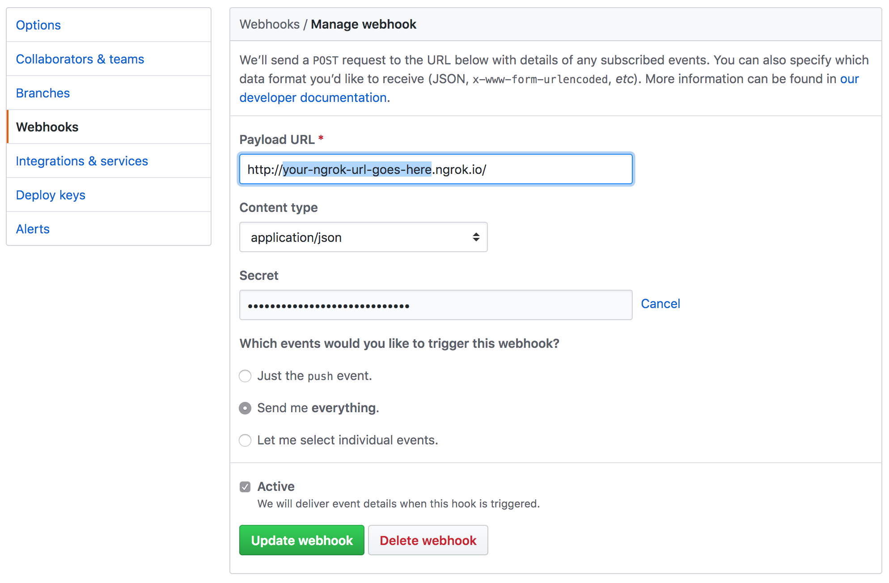
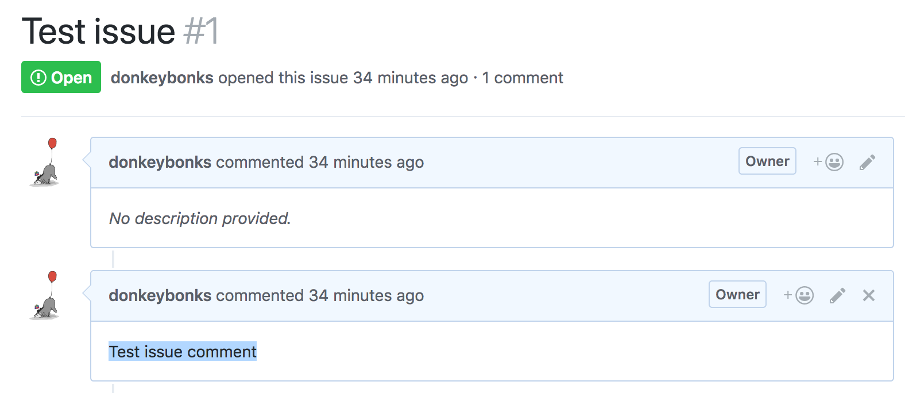

github-webhooks-servant-example
-------------------------------

1. From the **root directory of this repository**, run:
```
$ stack build github-webhooks-servant-simple-example --stack-yaml "stack-examples.yaml"
```

2. Then to start the server:
```
$ PORT=8080 KEY=YOUR_GITHUB_TEST_SECRET stack exec github-webhooks-servant-example
```

3. It will prompt you to install and run [ngrok](https://ngrok.com/) so that you can test your local server with responses from GitHub:
```
$ brew install ngrok # or apt-get install
$ ngrok http 8080
```

4. Navigate to your test repository on GitHub and configure your forwarding address and secret:


5. Post a test issue comment as follows:


6. The terminal will echo your comment if your hook is configured correctly. You can replay the comment payload from the webook control panel in the repository settings (so there is no need to post many comments).
