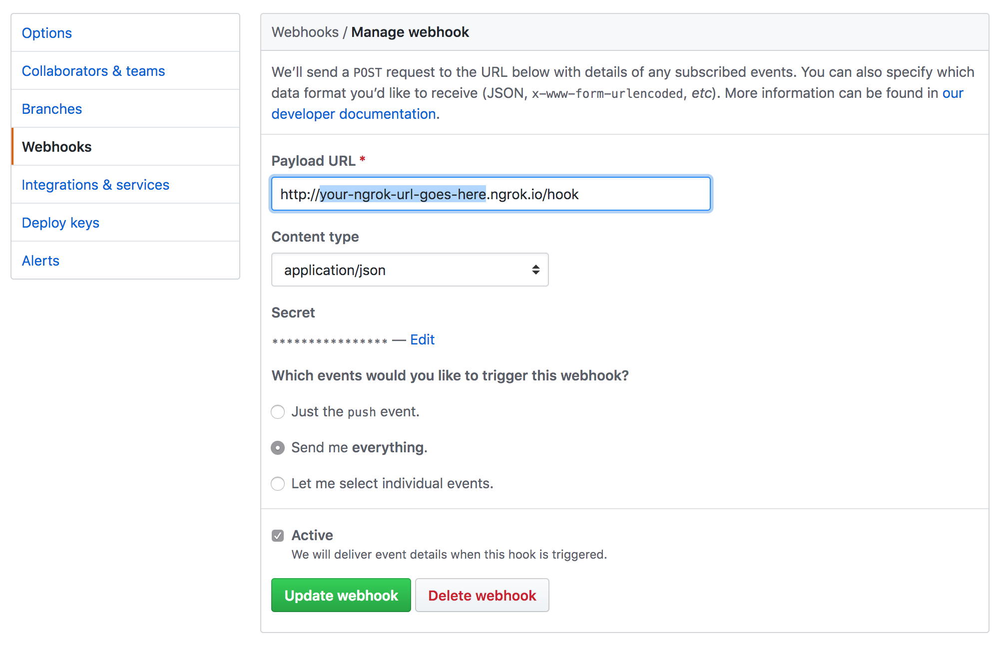

github-webhooks-servant-example
-------------------------------

1. From the **root directory of this repository**, run:
```
$ stack build github-webhooks-servant-example
```

2. Then to start the server:
```
$ PORT=8080 KEY=YOUR_GITHUB_TEST_SECRET stack exec github-webhooks-servant-example
```

3. It will prompt you to install and run [ngrok](https://ngrok.com/) so that you can test your local server with responses from GitHub:
```
$ brew install ngrok # or apt-get install
$ ngrok http 8080
```

4. Navigate to your test repository on GitHub and configure your forwarding address (make sure to include `/hook`) and secret:


5. Post a test issue comment as follows:


6. Push a commit to the target repository.

6. The terminal will echo your comment/commit push SHA if your hook is configured correctly. You can replay the payloads from the webook control panel in the repository settings.
